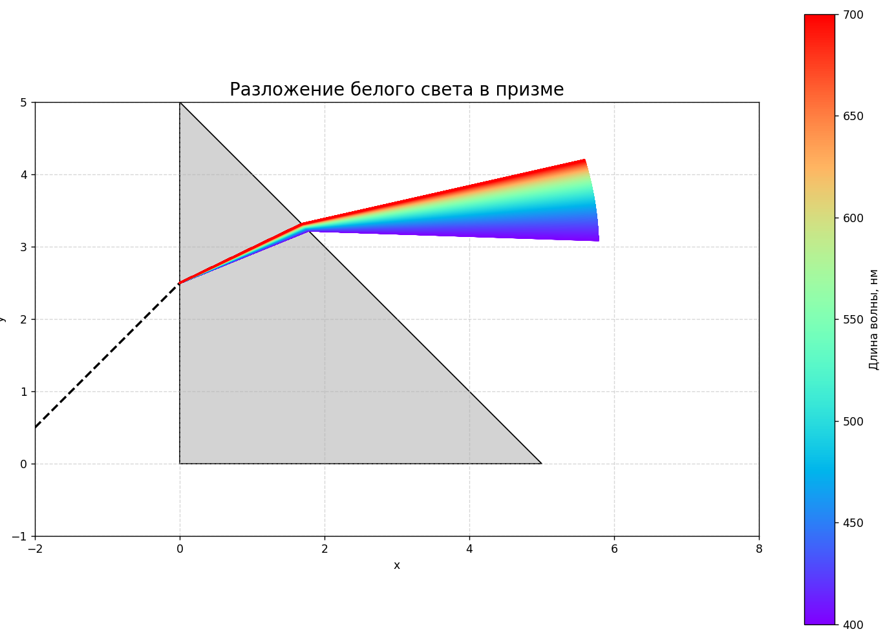

# Моделирование преломления света в призме

Программа моделирует процесс разложения белого света на спектр при прохождении через треугольную призму. Используется физическая модель дисперсии, основанная на уравнении Коши, и законы преломления (Снелла) для расчёта траекторий лучей разных длин волн.

---

## Техническое задание

### Цель программы:
- Показать разложение белого света в оптической призме.
- Расчитать углы отклонения для различных длин волн.
- Визуализировать выходящий спектр как цветную полосу.

### Основные функциональные модули:
1. **Ввод параметров** — показатель преломления при 550 нм, угол падения, параметр A уравнения Коши.
2. **Проверка корректности данных**.
3. **Модель дисперсии** — вычисление зависимости `n(λ)` по уравнению Коши.
4. **Расчёт хода лучей** — применение закона Снелла и условия полного внутреннего отражения.
5. **Графическое представление** — построение траекторий лучей и цветовой градиент по длинам волн.

---

## Физические основы

### Дисперсия света
Дисперсией называется зависимость показателя преломления вещества от длины волны света. Для моделирования используется уравнение Коши:

$$
n(\lambda) = A + \frac{B}{\lambda^2}
$$

где:
- $ A $ и $ B $ — эмпирические коэффициенты,
- $ \lambda $ — длина волны в метрах.

В данном случае задаются значения:
- $ n_{550} $ — показатель преломления на длине волны 550 нм,
- $ A $ — параметр уравнения,
откуда можно вычислить $ B $ как:

$$
B = (n_{550} - A)\cdot \lambda_0^2
$$

### Закон Снелла
При переходе светового луча из одной среды в другую его направление изменяется согласно закону Снелла:

$$
n_1 \sin\theta_1 = n_2 \sin\theta_2
$$

Используется для расчёта направления преломлённого луча.

### Полное внутреннее отражение
Если свет переходит из более плотной среды в менее плотную под углом больше критического, происходит полное внутреннее отражение:

$$
\theta_c = \arcsin\left(\frac{n_2}{n_1}\right)
$$

Это учитывается при выходе луча из призмы.

### Угол Брюстера
Угол, при котором отражённый свет становится полностью поляризованным:

$$
\theta_B = \arctan(n)
$$

Он также учтён в коде для анализа поведения света при падении на границу раздела.

---

## Реализация программы

### Входные данные
Программа запрашивает следующие параметры:
- Показатель преломления призмы на длине волны 550 нм.
- Угол падения белого света на призму (в градусах).
- Параметр A уравнения Коши.

Все параметры проверяются на физическую корректность:
- $ 1 < n_{550} < 3 $
- $ 0^\circ \leq \text{угол падения} < 90^\circ $
- $ 1 \leq A \leq 2 $

### Обработка ошибок
В случае некорректных значений выводится сообщение об ошибке, и программа завершает работу.

### Диапазон длин волн
Для моделирования спектра используется диапазон от 400 до 700 нм с шагом 0.03 нм (всего 10000 точек). Каждой длине волны ставится в соответствие цвет радужного спектра.

### Геометрия призмы
Призма моделируется как прямоугольный равнобедренный треугольник с катетами длиной `h = 5.0`. Начальная точка входа луча — середина вертикальной грани.

### Расчёт хода лучей
Для каждого луча:
1. Рассчитывается показатель преломления при заданной длине волны.
2. Определяется направление луча после первого преломления на границе воздух-призма.
3. Находится точка пересечения луча с гипотенузой призмы.
4. Вычисляется дальнейший путь луча:
   - При полном внутреннем отражении — луч отражается внутри призмы.
   - При обычном преломлении — луч выходит в воздух под новым углом.

### Цветовая визуализация
Цвета лучей выбираются в соответствии с их длиной волны, используя колор-мап `rainbow`. Добавлен цветной вертикальный цветовой бар с подписью "Длина волны, нм".

---

## Графический интерфейс

### Основные элементы графика:
- Призма — закрашенный серым треугольник.
- Лучи — линии, окрашенные в цвета радуги.
- Цветовая шкала — справа от графика.
- Дополнительные пунктирные линии — для начального направления и отражений.
- Подписи осей, заголовок графика, сетка.

### Настройки области отрисовки:
- Горизонтальный диапазон: от -2 до 8.
- Вертикальный диапазон: от -1 до 5.

---

## Пример работы программы

### Входные данные:
Введите показатель преломления призмы при 550 нм: 1.7\
Введите угол падения белого света на призму (в градусах): 45\
Введите параметр A для уравнения Коши (зависит от материала): 1.5

### Результат:
На экране отображается:

---

## Особенности и ограничения

### Особенности:
- Точное моделирование дисперсии по уравнению Коши.
- Учёт всех возможных явлений: преломление, отражение, полное внутреннее отражение.
- Моделирование на уровне отдельных лучей, что обеспечивает высокую наглядность.

### Ограничения:
- Не моделируется интерференция или дифракция.
- Все расчёты производятся в двумерном пространстве.
- Призма имеет фиксированную форму (прямоугольный равнобедренный треугольник).
